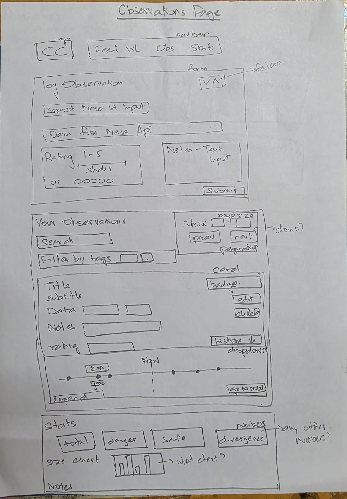
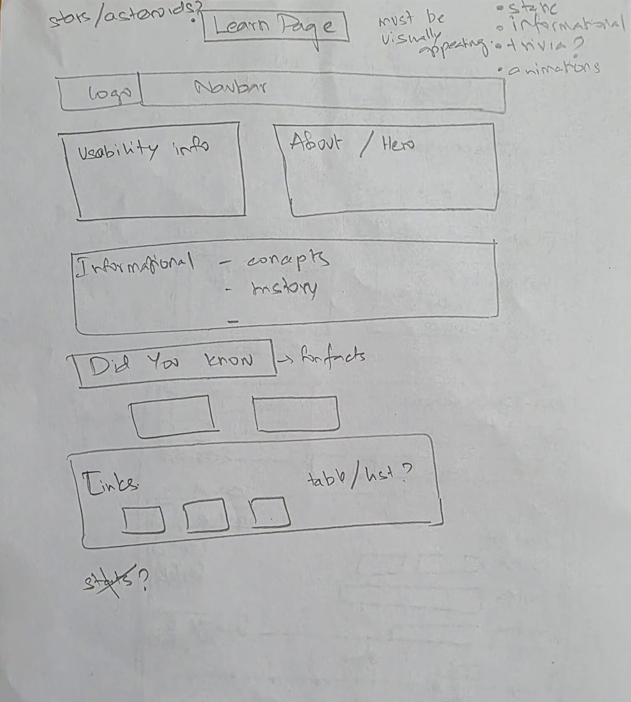

# Design Document — CloseCall

---

## Project Description

CloseCall is a full-stack asteroid threat dashboard built as part of CS 5610 Web Development at Northeastern University, by Aishwarya Rajmohan and Priyan Baskar.

Every week, dozens of asteroids fly past Earth — some closer than the Moon — and almost nobody knows it's happening. NASA tracks all of them and publishes the data for free, but it's buried in a raw API nobody casually opens. CloseCall pulls that live feed into a readable dashboard. The feed shows what actually matters: how close, how fast, how big, and flags anything NASA considers hazardous.

On top of the live feed, CloseCall adds a personal layer. Save asteroids to a watchlist, log observations with personal danger ratings and notes, and explore a full timeline of every known Earth approach for any asteroid — past and future — pulled live from NASA. A stats panel shows your observation activity, top tags, and where your danger ratings diverge from NASA's official classification.

CloseCall uses two MongoDB collections. The watchlist collection supports full CRUD: users can save, view, edit, and delete tracked asteroids. The observations collection supports full CRUD: users can log, view, edit, and delete personal research entries.

The project is split between two developers. Priyan Baskar built the Feed and Watchlist — the live data layer. Aishwarya Rajmohan built the Observations and Learn pages, the backend API, and the database layer.

**Tech stack:** Vanilla JavaScript (ES6 Modules), HTML5, CSS3, Node.js + Express, MongoDB (native driver), NASA NeoWs API, Fetch API.

---

## User Personas

### Persona 1 — Dr. Grace, The Astronomy Educator

**Role:** High school or university astronomy teacher
**Goal:** Pull up real, current asteroid examples in class without digging through NASA's raw data

Dr. Grace needs accurate, live data she can open on a projector and explain without a data science degree. She wants to filter by hazard status or size to find objects relevant to that week's lesson. She logs observations as teaching notes — recording what she showed the class, what the numbers meant, and whether she agreed with NASA's risk classification. She saves especially interesting objects to a watchlist so she can revisit their approach history in future classes.

---

### Persona 2 — Ash, The Space Enthusiast

**Role:** Curious amateur, space community member
**Goal:** One place to track close calls — the "we live in a shooting gallery" reality of near-Earth objects

Ash follows space news actively and wants a dashboard that reflects the real situation, not a scary headline or a buried API response. He wants to sort the feed by miss distance, save the ones that catch his attention with personal tags and nicknames, and log his own danger assessments to track where he disagrees with NASA. He uses the watchlist as a living personal catalogue of objects worth watching.

---

### Persona 3 — Rocky, The Casual Doom-Scroller

**Role:** General public, prompted by a news headline
**Goal:** Understand what's actually incoming, what's hazardous, and how close the alarming ones have gotten before

Rocky got curious after a news article called an asteroid "potentially city-ending." He wants to verify that for himself without becoming a scientist. He needs the data in plain terms — miss distance shown as Lunar Distances not just kilometers, a size comparator that puts an asteroid next to something he knows, and a timeline that shows whether this rock has come close before. He logs an observation for anything that alarms him, giving it his own rating and notes, and checks back to see if his assessment diverged from NASA's.

---

## User Stories

The following user stories were defined in the project proposal and guided the feature set of the app.

**Watchlist (Priyan Baskar)**

- As Ash, I want to save an asteroid to my watchlist with a personal nickname and tag so I can organize and label close calls in my own words.
- As Ash, I want to view all my saved asteroids in one place so I can see my full watchlist at a glance.
- As Ash, I want to edit the tag or note on a saved asteroid so my watchlist stays organized.
- As Ash, I want to delete an asteroid from my watchlist so I can remove ones I no longer care about.

**Feed (Priyan Baskar)**

- As Ash, I want to browse this week's asteroid feed sorted by miss distance so I can immediately see which ones came closest.
- As Dr. Grace, I want to filter the feed by size and hazard status so I can find objects relevant to what I am teaching that week.

**Observations (Aishwarya Rajmohan)**

- As Rocky, I want to log an observation for an asteroid with a danger rating and notes so I can build a personal research record.
- As Rocky, I want to view all my logged observations so I can revisit objects I have researched before.
- As Rocky, I want to edit an observation so I can update my notes as I learn more about an object.
- As Rocky, I want to delete an observation so I can remove entries I no longer need.
- As Rocky, I want to see a timeline of every known Earth approach for an asteroid I've logged so I can understand its full history.

---

## Division of Work

**Priyan Baskar — Live Feed & Watchlist (Full-Stack)**

- Frontend: Threat Board (live asteroid feed, filters, sort, size comparator) and Watchlist page (saved asteroids with live-refreshed approach data, edit and delete controls)
- Backend & DB: Express CRUD routes for the watchlist collection and NASA NeoWs proxy routes for the feed and per-asteroid refresh

**Aishwarya Rajmohan — Observations & Learn (Full-Stack)**

- Frontend: Observations page (log form, observation cards, approach timeline, divergence badges, search, stats panel) and Learn page (asteroid science reference, HOW TO USE guide, animated star background)
- Backend & DB: Express CRUD routes for the observations collection, NASA proxy route for timeline data, seed script for the reference catalogue, shared DB connector module, shared frontend infrastructure (nav, api.js, utils.js, styles.css)

---

## Design Mockups

Feed page — live asteroid table with hazard badges, sort/filter controls, and size comparator:

Watchlist page — saved asteroids with live next-approach lookup and edit/delete controls:

Observations page — personal log form, tag filter, search, and divergence badges:

Learn page — asteroid science reference and how-to guide with animated star background:

---

## Design Decisions

### Visual theme

Dark space aesthetic with a warm amber accent — the colour palette evokes both the void of space and the glow of a threat warning. CSS custom properties define the entire palette in `:root`, making it trivially swappable. The star background animation uses `background-position` tiling (not `transform: translate`) to create a seamless, infinite drift without visible seams.

### Typography and hierarchy

All-caps section labels and data fields create a dashboard reading pattern — the eye scans vertically down labels, then right to values. Card titles use a heavier weight to anchor the object name before any other data.

### Colour-coded distance

Miss distance bars are colour-coded by Lunar Distance: green for safe (>1 LD), amber for watch (<1 LD), red for close (<0.2 LD). This gives an at-a-glance threat signal without reading a number. The same colour classes are used consistently across the Feed and Watchlist.

### Lunar Distance alongside km

Miss distances from NASA arrive in km. The app converts and displays LD inline — `461,200 km ≈ 1.20 LD` — because LD is the unit that gives a non-expert immediate intuitive scale. The conversion (`km / 384,400`) is computed client-side on render.

### Divergence detection

The app compares the user's 1–5 danger rating against NASA's `is_potentially_hazardous_asteroid` boolean. A danger rating ≥ 4 that disagrees with a SAFE classification, or a rating ≤ 2 on a HAZARDOUS object, triggers the DIVERGENCE badge — making the user's disagreement with NASA visible and trackable.

### Deep linking

The Log button in the Feed generates a `?nasaId=` URL parameter that `observations.html` reads on load. This pre-fills the asteroid search in the observation form and auto-populates all NASA data fields — reducing the friction between "seeing something in the feed" and "logging a personal assessment" to a single click.

### Layout and responsiveness

Flexbox throughout — no CSS grid, no Bootstrap. The nav collapses to a hamburger at 600px on all four pages using a shared `nav.js` module. The observations form stacks vertically on mobile. The feed table scrolls horizontally on narrow viewports.

### Approach timeline

Each observation card has an expandable approach history panel that fetches all known Earth passes for that asteroid from NASA — past and future — and renders them as a horizontal scrollable timeline. A "GO TO NOW" button auto-scrolls to the current date marker. This gives users like Rocky the full historical context for any object they've logged, not just the one approach that caught their attention.

### Stats panel

The observations page includes a stats panel that aggregates the user's log: total observations, breakdown by tag, and a divergence table showing the top 5 cases where the user's danger rating disagreed with NASA's classification. The divergence table shows the asteroid name, the user's rating, NASA's classification, and the user's own notes — making the disagreement explicit and reviewable.

### Pagination and search

The observations list supports client-side pagination (20 / 50 / 100 per page) and real-time name search. Filtering by tag and searching by name compose together — both filters apply simultaneously on the in-memory `allObservations` array without a network round-trip.

### Accessibility

All interactive elements use semantic HTML — `<button>`, `<a>`, `<nav>`, `<form>`. Icon-only buttons carry `aria-label`. Decorative icons use `aria-hidden="true"`. The hamburger button uses `aria-expanded` to reflect open/closed state.
