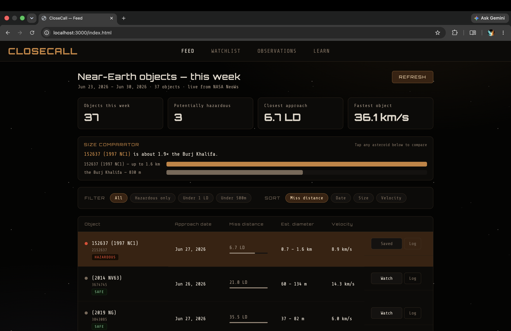
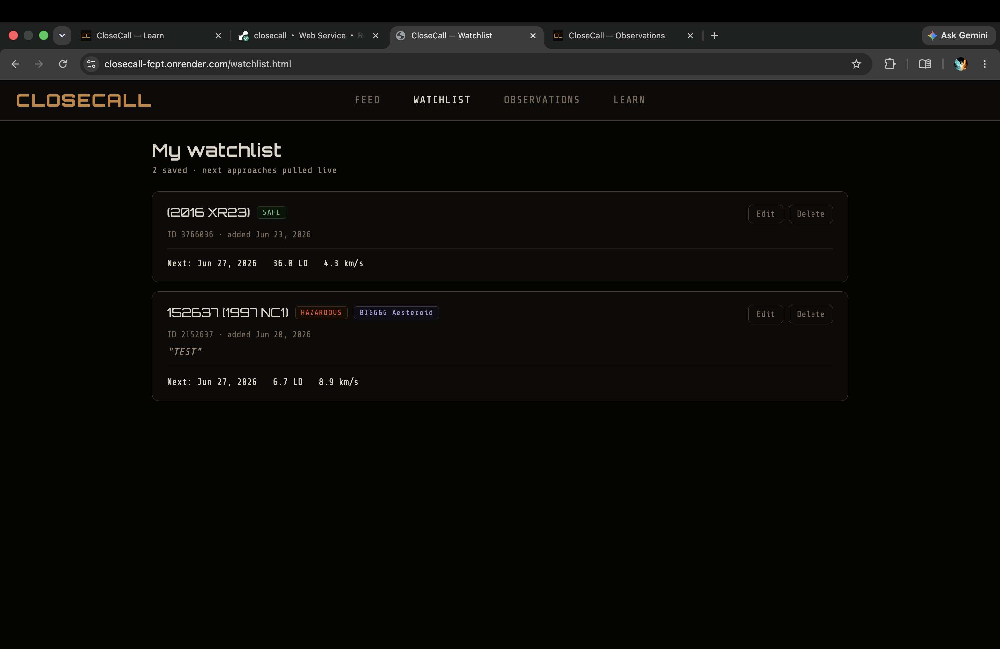
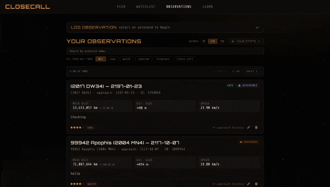
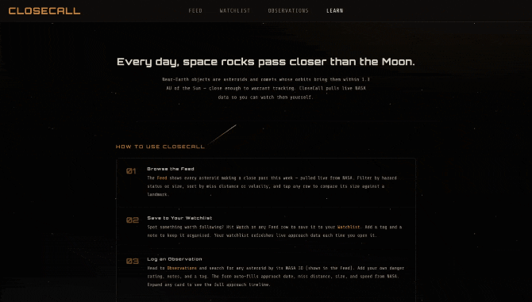

# CloseCall — NASA Near-Earth Object Tracker

A full-stack asteroid threat dashboard that pulls live data from NASA's NeoWs API and layers a personal observation system on top — log your own assessments, track asteroids on a watchlist, and compare your danger ratings against NASA's classifications.

---

## Authors

**Aishwarya Rajmohan** [LinkedIn](https://linkedin.com/in/aishwaryamohan1698) · [GitHub](https://github.com/aish6498-hub) - Observations page, Learn page, backend API & DB layer (observations, nasa routes), code organization

**Priyan Baskar** [LinkedIn](https://www.linkedin.com/in/priyan-baskar-a1263227a/) · [GitHub](https://github.com/priyan-b) - Feed page, Watchlist page, NASA NeoWs integration and API proxy

---

## Class Link

[CS 5610 — Web Development](https://johnguerra.co/classes/webDevelopment_online_summer_2026/)

---

## Deployment

The app is deployed at:
[https://closecall-fcpt.onrender.com/](https://closecall-fcpt.onrender.com/)

---

## Project Objective

CloseCall is a tool for making NASA's raw Near-Earth Object data approachable.

NASA's NeoWs API is accurate but dense — it returns hundreds of fields per object with no filtering, no narrative context, and no way to track what you've already looked at. CloseCall turns that into a readable threat dashboard: a weekly feed sorted by miss distance, hazard badges, a size comparator that scales asteroids against familiar objects (a school bus, the Eiffel Tower), and a stats panel.

The personal layer is what makes it a real tool rather than a NASA mirror. You can save asteroids to a watchlist, log your own observations with a 1–5 danger rating and notes, and see a **Divergence badge** wherever your assessment disagrees with NASA's hazard classification. The stats panel surfaces these divergences, your most-watched tags, and your observation activity over time.

### Features

_Priyan Baskar_

- **Live feed** — this week's near-Earth objects pulled directly from NASA NeoWs, sortable by miss distance, date, size, or velocity
- **Hazard badges** — HAZARDOUS / SAFE classification with color-coded miss distance bars
- **Size comparator** — scales each asteroid against a real-world reference object
- **Watchlist** — save asteroids to monitor with tags and notes; next approach pulled live
- **Log button** — one-click deep link from the feed into the observation form for any asteroid

_Aishwarya Rajmohan_

- **Observations log** — full CRUD for personal assessments: danger rating, tag, notes, miss distance, size, speed
- **Divergence detection** — flags where your danger rating disagrees with NASA's classification
- **Search by name** — filter your observations by asteroid name client-side
- **LD conversion** — miss distances shown in km alongside Lunar Distance (LD) for intuitive scale
- **Stats panel** — observation counts, top tags, divergence summary
- **HOW TO USE** — built-in guide on the Learn page explaining each step
- **Mobile responsive** — hamburger nav on all 4 pages, responsive layouts down to 375px

---

## Screenshot

Feed page — live asteroid table sorted by miss distance:


Watchlist page - saved asteroids with live next-approach lookup


Observations page — personal log with search, tags, and divergence badges:


Learn page — asteroid science reference and how-to guide:


---

## Pages

| Page                | Author    | Description                                                           |
| ------------------- | --------- | --------------------------------------------------------------------- |
| `index.html`        | Priyan    | Live NASA feed, stats bar, size comparator, filter/sort pills         |
| `watchlist.html`    | Priyan    | Saved asteroids with live next-approach lookup                        |
| `observations.html` | Aishwarya | Personal observation log — add, edit, delete, search, paginate        |
| `learn.html`        | Aishwarya | Asteroid science glossary, HOW TO USE guide, shooting-star background |

---

## Tech Stack

**Frontend**

- HTML5 — semantic structure, ARIA labels, accessibility attributes
- CSS3 — custom properties, flexbox, grid, `@keyframes` animations
- ES6+ — native modules (`type="module"`), `async/await`, `fetch`
- Font Awesome 6 — icons

**Backend**

- Node.js + Express 5 — REST API server
- MongoDB (via official driver) — observations and watchlist persistence
- NASA NeoWs API — live near-Earth object data

**Tooling**

- ESLint + Prettier — code quality and formatting
- nodemon — dev server auto-restart
- dotenv — environment variable management

---

## Project Structure

```
/
  server.js                   # Express entry point                        [Aishwarya]
  /db
    connection.js             # MongoDB connector module                   [Aishwarya]
  /routes
    nasa.js                   # NASA NeoWs proxy route                     [Priyan]
    observations.js           # Observations CRUD routes                   [Aishwarya]
    watchlist.js              # Watchlist CRUD routes                      [Priyan]
  /scripts
    seedObservations.js       # Dev seed script for sample data            [Aishwarya]
  /frontend
    index.html                # Feed page                                  [Priyan]
    watchlist.html            #                                            [Priyan]
    observations.html         #                                            [Aishwarya]
    learn.html                #                                            [Aishwarya]
    /css
      styles.css              # Global styles, nav, shared components      [Aishwarya]
      feed.css                #                                            [Priyan]
      watchlist.css           #                                            [Priyan]
      observations.css        #                                            [Aishwarya]
      learn.css               #                                            [Aishwarya]
    /js
      api.js                  # All fetch calls to backend (module)        [Priyan]
      utils.js                # Shared helpers — escHtml, isDivergence     [Aishwarya]
      format.js               # Display formatters — formatLD, formatVelocity [Priyan]
      nav.js                  # Shared hamburger nav logic (module)        [Aishwarya]
      feed.js                 # Feed page logic                            [Priyan]
      watchlist.js            # Watchlist page logic                       [Priyan]
      observations.js         # Observations page logic                    [Aishwarya]
      learn.js                # Learn page — shooting stars animation      [Aishwarya]
    /assets
      /favicons                                                             [Aishwarya]
  package.json
  eslint.config.js
  .env.example
  .gitignore
  LICENSE
  README.md
```

---

## Instructions to Build

### Prerequisites

- [Node.js](https://nodejs.org/) v18 or higher
- npm (comes with Node.js)
- A MongoDB instance (local or [MongoDB Atlas](https://www.mongodb.com/cloud/atlas) free tier)
- A [NASA API key](https://api.nasa.gov/) (free, instant)

### 1. Clone the repo

```bash
git clone https://github.com/aish6498-hub/closecall.git
cd closecall
```

### 2. Install dependencies

```bash
npm install
```

### 3. Set up environment variables

Copy `.env.example` to `.env` and fill in your values:

```bash
cp .env.example .env
```

```env
MONGODB_URI=mongodb+srv://<user>:<password>@cluster.mongodb.net/closecall
NASA_API_KEY=your_nasa_api_key_here
PORT=3000
```

### 4. (Optional) Seed sample observations

```bash
npm run seed
```

This populates the database with sample observations for development.

### 5. Start the server

```bash
npm start
```

The app runs at [http://localhost:3000](http://localhost:3000) and auto-restarts on file changes via nodemon.

---

## GenAI Usage

AI tools were used as a collaborative aid throughout development — not to generate the app, but to accelerate decisions and debug tricky interactions. All code was reviewed and understood before use. Design decisions and creative direction were our own.

### Tools used

| Tool               | Version           |
| ------------------ | ----------------- |
| Claude (Anthropic) | Claude Sonnet 4.6 |

### How it was used

- **Ideation** — bouncing layout and interaction ideas, getting feedback on feature prioritization
- **Debugging** — diagnosing CSS z-index stacking issues, mobile nav dropdown transparency, animation seams
- **Snippet generation** — requesting targeted snippets for specific problems, not full-page generation
- **Code review** — catching duplicate CSS rules, dead files, and code extraction opportunities
- **Refactoring** — extracting duplicated hamburger nav code into a shared `nav.js` module
- **Enhancement suggestions** — LD conversion display, deep-link Log button, divergence capping in stats

### Sample prompts used

```
"the mobile nav dropdown is transparent and unclickable, what is causing it?"

"the star animation looks like a repeated gif, how do I make it seamlessly continuous?"

"cap the divergences list to top 5 and rename the column to YOUR NOTES"

"extract the duplicated hamburger nav code from all 4 page JS files into a shared module"

"add search by asteroid name to the observations page — client-side filter"

"show lunar distance alongside km in the miss distance field of observation cards"

"create a clear and descriptive README including: Author, Class Link, Project Objective, Screenshot, Instructions to build"
```

---

## License

[MIT](./LICENSE)
